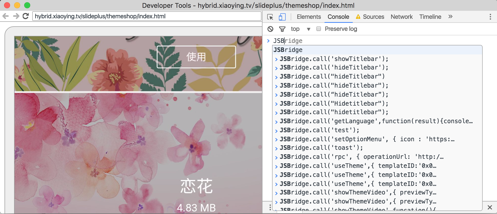
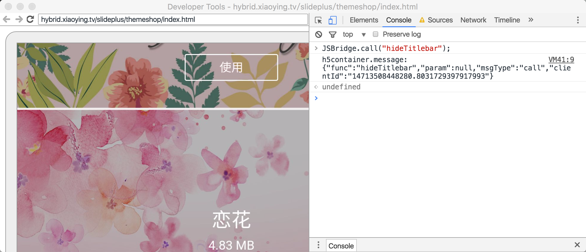
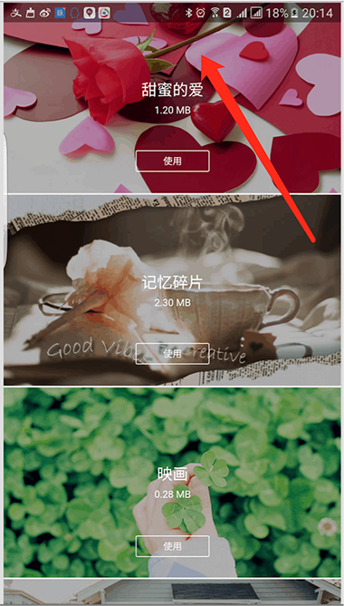

# Hybrid调试指南
>
开发接口过程中如何自测接口?

## Dependency
>
- Chrome
- Android SDK Level >=19

## Usage

>
- Android设备连接电脑，并打开USB调试
- 通过Hybrid打开任意页面
- 使用Chrome浏览器打开，[chrome://inspect](chrome://inspect),  调用JSBridge对应的接口

## Picture
> - 以下是 “隐藏TitleBar”为例，通过JSBridge来隐藏Native的标题栏

- 打开Console控制台

- 注入JSBridge.call("hideTitlebar");

- App端隐藏掉Titlebar
- 

## Sample
>
- JSBridge.call("hideTitlebar")  ---Hide Title bar

<iframe height=350 width=550 src="http://192.168.1.33:9090/machao/worktilefiles/raw/master/inspect.mov"  frameborder=0>

